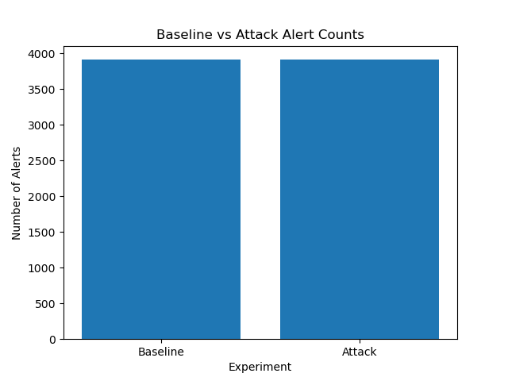

# A-Tool-for-Asset-Discovery-API-Risk-Assessment-with-IDS-Evaluation-and-Shadow-AI-Detection

## Overview
This project presents a Python-based cybersecurity framework designed for SMEs, integrating asset discovery, API risk assessment, intrusion detection system (IDS) evaluation, and Shadow AI detection into a unified analytical workflow.

The framework combines tools such as Nmap, Nikto, and Suricata with custom Python-based analysis modules to transform raw security data into structured and actionable cybersecurity insights.

---

## Features
- Asset discovery using Nmap
- API and web vulnerability scanning
- Suricata IDS analysis
- Behavioural alert analysis
- Risk scoring and prioritisation
- Dashboard visualisation
- Shadow AI detection

---

## Technologies Used
- Python
- Suricata
- Nmap
- Nikto
- Kali Linux
- Ubuntu
- Matplotlib

---

## Project Structure

```text
analyze_alerts.py
compare_runs.py
generate_report.py
security_framework.py
shadow_ai_detection.py
visualize_alerts.py
```

---

## Example Output

### Alert Volume Comparison
The framework compares baseline and attack traffic scenarios to identify anomalous activity patterns.



---

## Project Aim
The aim of this project is to bridge the gap between raw security data and actionable insights for small and medium-sized enterprises (SMEs).

---

## Dissertation Context
Developed as part of the CI601 Computing Project at the University of Brighton.
